<h2> Hi , I'm Aman Jagotra! </h2>

<p><em>B.Tech CSE 2024 Graduate <a href="http://nith.ac.in">NIT Hamirpur</a></br> 
</em></p>

[](https://github.com/DragnEmperor)

###  A little more about me...

```javascript
const aman = {
  pronouns: "he" | "him",
  code: [Javascript, HTML, CSS, C ,C++, Python, Golang, Typescript],
  technologies: {
        frontEnd: [ReactJS, Redux, Gatsby, NextJS, TailwindCSS],
        backEnd: {
            js: ["Node", "Express"],
            python: ["Django", "DRF", "Flask", "FastAPI"]
        },
        databases: ["MongoDB", "MySql", "PostgreSQL"],
        misc: ["Firebase", "Azure", "AWS", "Docker"]
  },
  otherAlias: "A casual gamer who loves to play multiplayer Games like Valorant, Phasmophobia, Species Unknown.",
  funFact: "There are two ways to write error-free programs; only the third one works"
}
```

 <em><b>I love connecting with different people</b> so if you want to say <b>hi, I'll be happy to meet you more!</b> :)</em>

---

📈 my github stats
  
<p align="center">
 
</p>
